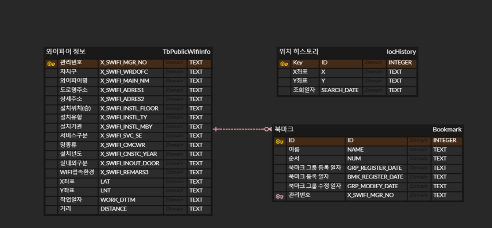

# BackendSchool_PublicWifiInfo
  get PublicWifiInfo by seoul_openAPI and manage data

implement MVC pattern in servlet coding.  
( front controller getting url and searching for right handler ->
                   get view returned by handler and pass parameters to right jsp file )

getting PublicWifiInfo (by single thread) from seoul_openAPI portal, web server throws wait page.  
After waiting, data is stored to sqlite database

with database crud functions and joining, webserver can display appropriate page where people want to see  
(like bookmark and bookmarkgroup, wifi information around me, etc)

Also with adequate css, jsp, javascript, html coding, webserver can display clean and readable web page 

ERD 파일  
(하나의 북마크는 하나의 와이파이 정보를 반드시 가지지만, 와이파이 정보는 여러 북마크로 지정될 수도 있고 지정되지 않을 수도 잇다.)

